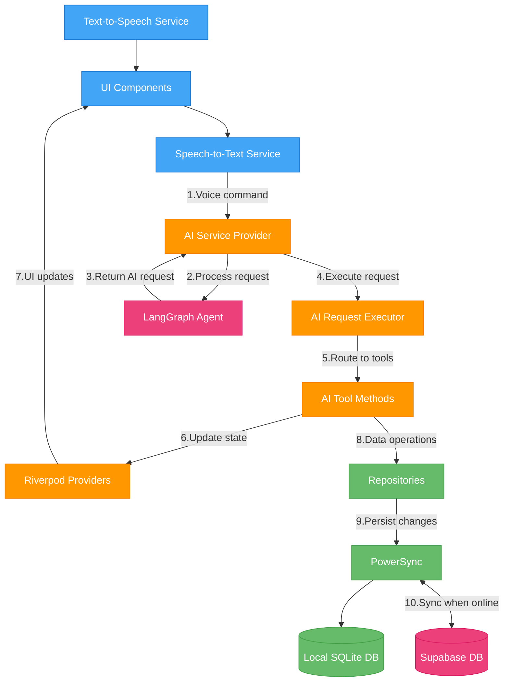

<p align="center">
  
</p>

<h1 align="center">Seren AI - Voice-Controlled Business Productivity Suite</h1>

<p align="center">
  
  
  
  
  
  
</p>

## Project Overview
Seren AI is an AI-native, cross-platform business productivity application that features advanced voice control capabilities. The AI control is seamlessly integrated into the client application, enabling real-time UI updates and facilitating complex multi-step operations through a single voice command.


### Key Technical Features

- **Integrated Agentic AI System**: Multi-node setup with recursive reasoning capabilities built on LangGraph and Llama-3-70B through Groq for super fast ai response times
- **Real-Time UI Control**: AI directly manipulates app state through a custom state control system
- **Cross-Platform Support**: Fully functional on iOS, Android, and Web platforms
- **Offline-First Architecture**: Seamless offline experience with PowerSync data synchronization
- **Enterprise-Ready Access Controls**: Role-based security with organization and project segregation
- **Riverpod State Management**: Clean, testable state management architecture
- **Interactive Data Visualizations**: Including custom Gantt chart implementation for project planning

## Demo

[GIF PLACEHOLDER: Voice command creating a new task]

[GIF PLACEHOLDER: AI updating multiple items from a single voice request]

[GIF PLACEHOLDER: Gantt chart visualization and interaction]

## Quick Start

```bash
# Clone the repository
git clone https://github.com/yourusername/seren_ai_flutter.git

# Navigate to the project directory
cd seren_ai_flutter

# Install dependencies
flutter pub get

# Run the app
flutter run
```

## Technical Architecture

Seren AI uses a multi-repository architecture to separate concerns:

1. **Client Application (This Repo)** - Flutter UI and state management
2. **[LangGraph Agentic AI](https://github.com/fjnoyp/seren-ai-langgraph)** - Reasoning engine powering voice commands
3. **[Supabase Backend](https://github.com/fjnoyp/seren_ai_supabase)** - Postgres DB and Edge Functions

The client architecture follows a service-oriented approach where each feature has its own dedicated folder containing models, repositories, providers, and UI components. This enables a clean separation of concerns while maintaining high cohesion between related elements.

### AI Integration Architecture



The AI system allows for complex multi-step operations from a single voice command through:

1. **Voice Processing**: Speech-to-text conversion of user commands
2. **Intent Recognition**: LangGraph agent analyzing and identifying required actions
3. **State Management Control**: AI tool control of Riverpod providers to update UI in real-time
4. **Execution Flow**: AI can fetch data, update models, and trigger UI changes in sequence

## Engineering Challenges & Solutions

### Challenge 1: Fast Conversational AI Responses

**Solution**: Custom optimization of Llama-3-70B through Groq with advanced retry logic and verification steps to achieve ChatGPT-level UX with more cost-effective models.

### Challenge 2: Reliable Offline-First Experience

**Solution**: Implemented PowerSync with custom conflict resolution strategies to maintain data integrity across devices even with intermittent connectivity.

### Challenge 3: Real-Time UI Updates from AI Actions

**Solution**: Developed a novel approach where AI generates structured operation requests that are executed against the app's state management system rather than just generating text responses.

## Contributors

- **Kyle Cheng** - [GitHub](https://github.com/fjnoyp) | [LinkedIn](https://www.linkedin.com/in/kylecheng/) - Lead Developer and Architect 
- **Renata Sisilio** - [GitHub](https://github.com/renata-sisilio) - Flutter Developer


