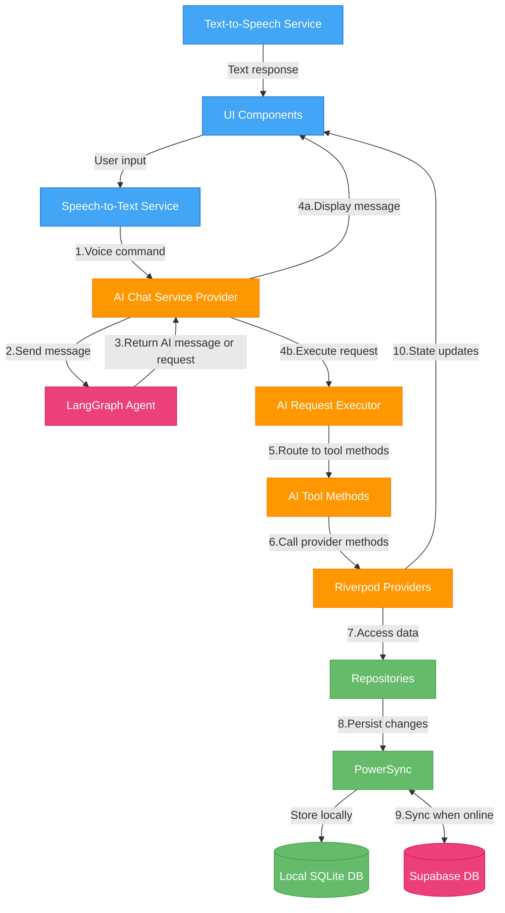

  

<h1 align="center">Seren AI - Voice-Controlled Business Productivity Suite</h1>

  
  
  
  
  
  

## Project Overview
Seren AI is an AI-native, cross-platform business productivity application that features advanced voice control capabilities. The AI control is seamlessly integrated into the client application, enabling real-time UI updates and facilitating complex multi-step operations through a single voice command.

### Key Technical Features

- **Integrated Agentic AI System**: Multi-node setup with recursive reasoning capabilities built on LangGraph and Llama-3-70B through Groq for super fast ai response times
- **Real-Time UI Control**: AI directly manipulates app state through a custom state control system
- **Cross-Platform Support**: Fully functional on iOS, Android, and Web platforms
- **Offline-First Architecture**: Seamless offline experience with PowerSync data synchronization
- **Enterprise-Ready Access Controls**: Role-based security with organization and project segregation
- **Riverpod State Management**: Clean, testable state management architecture
- **Interactive Data Visualizations**: Including custom Gantt chart implementation for project planning

## Demo

Mobile is testflight only.
Website is hosted live at: https://seren-ai.web.app/

Contact kylcheng@gmail.com for access, or login/pw is included in my resume. 

[GIF PLACEHOLDER: Voice command creating a new task]

[GIF PLACEHOLDER: AI updating multiple items from a single voice request]

[GIF PLACEHOLDER: Gantt chart visualization and interaction]

## Technical Architecture

Seren AI uses a multi-repository architecture to separate concerns:

1. **Client Application (This Repo)** - Flutter UI and state management
2. **[LangGraph Agentic AI](https://github.com/fjnoyp/seren-ai-langgraph)** - Reasoning engine powering voice commands
3. **[Supabase Backend](https://github.com/fjnoyp/seren_ai_supabase)** - Postgres DB and Edge Functions

The client architecture follows a service-oriented approach where each feature has its own dedicated folder containing models, repositories, providers, and UI components. This enables a clean separation of concerns while maintaining high cohesion between related elements.

For a comprehensive breakdown of the architecture, design patterns, and code organization, please refer to our [detailed architecture documentation](ARCHITECTURE.md).

## AI System Architecture

### Integration Overview

Seren AI features a sophisticated voice-controlled AI system that can perform complex operations by manipulating the application state directly. The AI is integrated at the core of the application architecture, not just as an add-on service.

### System Components & Data Flow

The AI system processes user requests through a structured pipeline:

1. **Voice Processing**: Speech-to-text conversion captures user commands
2. **Language Processing**: LangGraph agent analyzes input and produces either:
   - A simple text response to be displayed to the user, or
   - A structured AI request for performing operations

3. **Request Execution Framework**: When an AI request is generated, it flows through:
   - **Request Models**: Structured data classes that define parameters for operations
   - **Tool Methods**: Domain-specific services that implement business logic
   - **Result Handlers**: Format and display execution results to the user

4. **State Management Control**: Tool methods operate through Riverpod providers to update application state, maintaining proper reactivity throughout the UI

### Advanced Capabilities

The client-side AI integration enables:

- **Context-Aware Interactions**: The AI understands the user's current context (open screens, selected items, recent actions)
- **Multi-Step Operations**: Performs complex sequences from a single voice command
- **Visual Feedback**: Provides real-time UI updates as operations execute

### Domain-Specific Tools

The AI system implements specialized tools for various business functions:

- **Task Management**:
  - Creating, finding, and updating tasks with rich metadata
  - Example methods: `createTask()`, `updateTaskFields()`, `findTasks()`

- **Time Tracking**:
  - Managing shift assignments and clock in/out operations
  - Example methods: `getShiftAssignments()`, `toggleClockInOut()`

- **Notes & Documents**:
  - Creating, editing, and sharing notes with contextual awareness
  - Example methods: `createNote()`, `updateNote()`, `findNotes()`

This architecture enables complex voice commands like "Find overdue tasks assigned to me, change their status to in-progress, and add a comment explaining the delay" by translating them into a sequence of tool operations.

## Engineering Challenges & Solutions

### Fast Conversational Speed AI Responses

Problem: The AI system must respond to user requests in real-time, which requires fast response times.
Existing intelligent models like GPT-4 or Claude-3.7 are too slow for this use case.

Solution: I built the system using Llama-3-70B through Groq with advanced retry logic and verification steps to achieve ChatGPT-level UX with more cost-effective models and much faster response times.

### Real-Time UI Updates from AI Actions

Problem: The AI must be able to update and access data in the UI in real-time based to perform actions for the user. 

Solution: Client application UI controls are all controllabe via external providers, allowing the AI tool implementations to hook into providers to update and access data in the UI in real-time.

### Independent multi-step AI actions 

Problem: The AI must be able to perform independent multi-step actions, that require arbitrary, multiple tool calls to be performed in a specific order. 

Solution: The AI system uses a multi-node graph structure with recursive reasoning to enable complex, multi-step actions. 

### Reliable Offline-First Experience

Problem: The app must function offline and sync when online, ensuring data integrity across devices even with intermittent connectivity.

Solution: Implemented PowerSync with custom conflict resolution strategies to maintain data integrity across devices even with intermittent connectivity.

If you're interested in contributing to these ongoing engineering challenges or implementing new features, please see our [contributing guidelines](CONTRIBUTING.md) for development setup and workflow.

## Documentation

For more detailed information about the project, please refer to the following documentation:

- [Architecture Documentation](ARCHITECTURE.md) - Detailed overview of the system architecture, design patterns, and code organization
- [Contributing Guidelines](CONTRIBUTING.md) - Instructions for setting up the development environment and contribution workflow
- [UI Guidelines](UI_GUIDELINES.md) - Best practices for UI implementation and cross-device responsiveness

## Contributors

- **Kyle Cheng** - [GitHub](https://github.com/fjnoyp) | [LinkedIn](https://www.linkedin.com/in/kylecheng/) - Lead Developer and Architect 
- **Renata Sisilio** - [GitHub](https://github.com/renata-sisilio) - Flutter Developer

